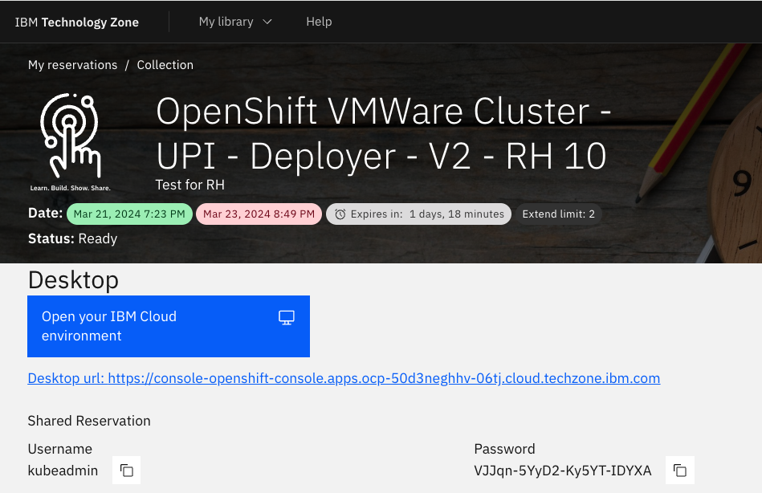
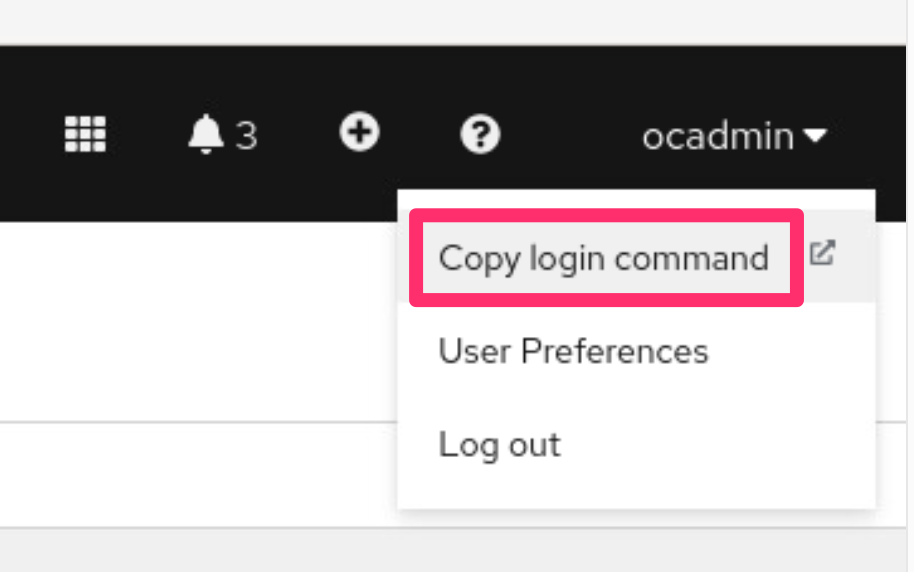
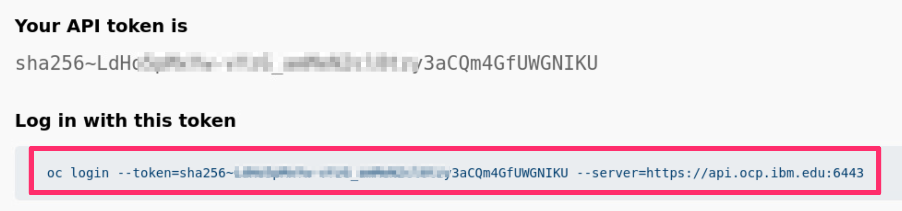
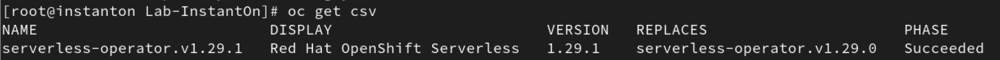
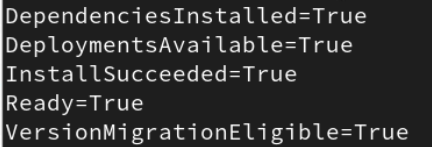

# Instructions for setting up Knative on the OCP cluster

These instructions should only be completed if:

1. You are the workshop instructor and you need to set up Knative on OCP so that all students will able to run InstantOn applications on that shared platform.

2. You are attempting to complete the lab on your own outside of a workshop environment.
   
It can also serve as a good reference for workshop attendees wishing to get details on what is involved in the Knative setup process.

### Clone the application from GitHub

Login as root using the password provided in the TechZone VM reservation:

```bash
su --login root
```

```bash
cd /home/techzone
git clone https://github.com/rhagarty/techxchange-knative-setup.git
cd techxchange-knative-setup
```

### Login to the OpenShift console

Click on the TechZone OCP reservation to find the link to the OpenShift console UI, along with the username and password to access the console.



### Login to the OpenShift CLI

From the OpenShift console UI, click the username in the top right corner, and select `Copy login command`.



Press `Display Token` and copy the `Log in with this token` command.



Paste the command into your terminal window. You should receive a confirmation message that you are logged in.

### Install the OpenShift serverless operator

Switch to the "default" namespace:

```bash
oc project default
```

Type the following commands to install the serverless operator.

```bash
oc apply -f serverless-subscription.yaml
```
```bash
oc apply -f serving.yaml
```

### Verify the OpenShift serverless operator is installed and ready

```bash
oc get csv
```

You should see the following output:



### Install the Cert Manager 

The Cert Manager adds certifications and certification issuers as resource types to Kubernetes

```bash
kubectl apply -f https://github.com/cert-manager/cert-manager/releases/download/v1.12.3/cert-manager.yaml
```

### Verify the Knative service is ready

```bash
oc get knativeserving.operator.knative.dev/knative-serving -n knative-serving --template='{{range .status.conditions}}{{printf "%s=%s\n" .type .status}}{{end}}'
```

Your output should match the following:



### Edit the Knative permissions to allow to the ability to add Capabilities

```bash
kubectl -n knative-serving edit cm config-features -oyaml
```

Add in the following line just bellow the “data” tag at the top:
```yaml
kubernetes.containerspec-addcapabilities: enabled
```

> **IMPORTANT**: to save your change and exit the file, hit the escape key, then type `:x`. 

### Run the following commands to give applications the correct Service Account (SA) and Security Context Contraint (SCC) to run instantOn

```bash
oc create serviceaccount instanton-sa
oc apply -f scc-cap-cr.yaml
oc adm policy add-scc-to-user cap-cr-scc -z instanton-sa
```

> **NOTE**: Knative will stop the pod if it does not receive a request in the specified time frame, which is set in a configuration yaml file. For this lab, the settings are in the `serving.yaml` file, and currently set to 30 seconds (as shown below).

```bash
apiVersion: operator.knative.dev/v1beta1
kind: KnativeServing
metadata:
    name: knative-serving
    namespace: knative-serving
spec:
  config:
    autoscaler:
      scale-to-zero-grace-period: "30s"
      scale-to-zero-pod-retention-period: "0s"
```

### In order to build InstantOn images, enable sandbox containers to use netlink system calls. 

```bash
setsebool virt_sandbox_use_netlink 1
```
